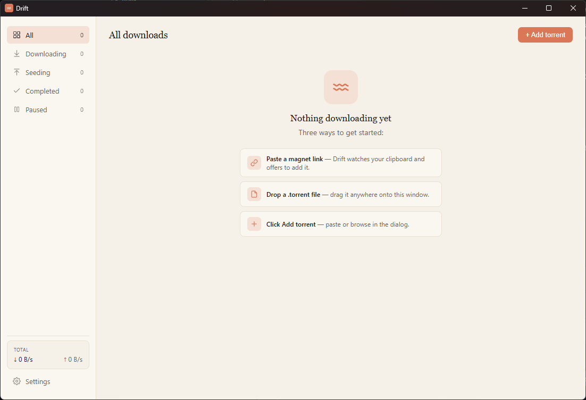

<p align="center">
  
</p>

<h1 align="center">Drift</h1>

<p align="center">
  A clean, fast, native <b>Windows torrent client</b> with a warm, Claude-inspired interface.
</p>

<p align="center">
  <a href="https://github.com/tektungg/Drift/releases/latest"></a>
  
  
</p>

---

**Drift** is a lightweight torrent app that gets out of your way. Paste a magnet link, drop a `.torrent` file, and it just downloads — neatly sorted into folders by file type, with a calm interface that doesn't look like it's from 2009. It's a ~10 MB install, sits quietly in your system tray, and watches your clipboard so adding a torrent is as simple as copying its link.

<p align="center">
  
</p>

## Features

- **Drop-dead simple adding** — paste a magnet, drag a `.torrent` onto the window, or let the clipboard watcher catch magnet links automatically and offer to download them.
- **Auto-organized downloads** — files land in tidy category folders (Video, Audio, Documents, Compressed, Programs, Images). Folder-style torrents go to their own named folder. Override the destination per-torrent whenever you like.
- **Pick exactly what you want** — choose which files inside a torrent to download, even mid-download.
- **At-a-glance status** — color-coded states (downloading, seeding, completed, paused, stalled), live speeds, peer counts, and ETA.
- **Stays out of the way** — close to the system tray and keep seeding; a single click brings it back.
- **Remembers everything** — your torrents resume automatically when you relaunch.
- **Speed limits & settings** — global up/down caps, start-with-Windows, and an editable category map.

## Download

Grab the latest installer from the [**Releases page**](https://github.com/tektungg/Drift/releases/latest):

- **`Drift_x64-setup.exe`** — recommended (NSIS installer, installs to Program Files)
- **`Drift_x64_en-US.msi`** — MSI alternative

Windows 10/11, 64-bit.

## Why Drift?

I just wanted a torrent client that was fast, looked nice, and did the boring organizing for me — without the bloat and dated UI of the usual options. Drift is that: a personal project built for daily use, with care put into both the engine and the feel.

## Built with

- [**Tauri 2**](https://tauri.app/) — tiny native window, real web-tech UI
- [**Rust**](https://www.rust-lang.org/) — the backend and app shell
- [**librqbit**](https://github.com/ikatson/rqbit) — a fast async BitTorrent engine
- Vanilla HTML/CSS/JS frontend — no framework, no build step

## Build from source

You'll need [Rust](https://rustup.rs/), the [Tauri CLI](https://tauri.app/start/prerequisites/) (`cargo install tauri-cli --version "^2.0" --locked`), and the Visual Studio Build Tools with the "Desktop development with C++" workload.

```powershell
# Run in development
cargo tauri dev

# Build installers (output in src-tauri/target/release/bundle/)
cargo tauri build
```

---

<p align="center"><sub>Made with care. Not affiliated with Anthropic — just a fan of the aesthetic.</sub></p>
